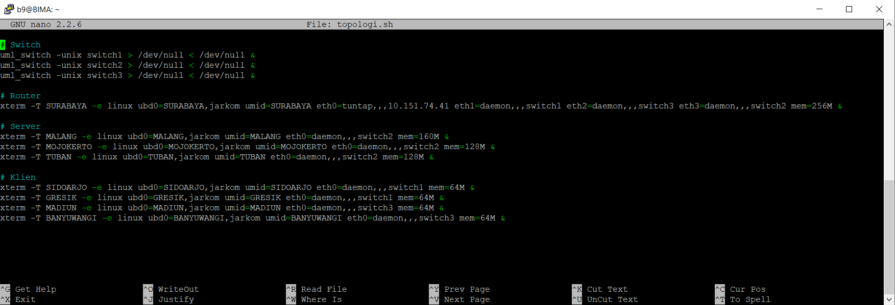
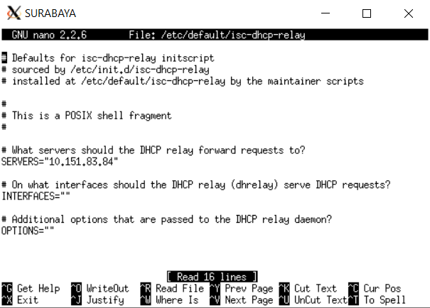
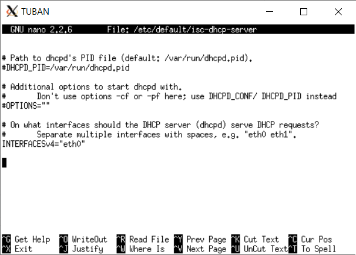
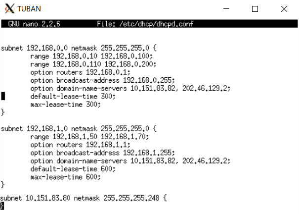
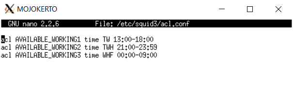
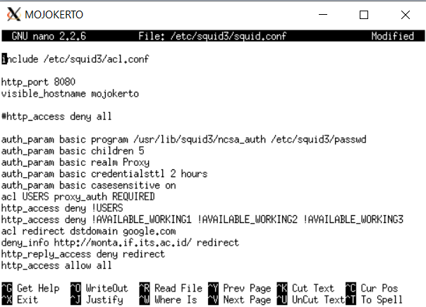
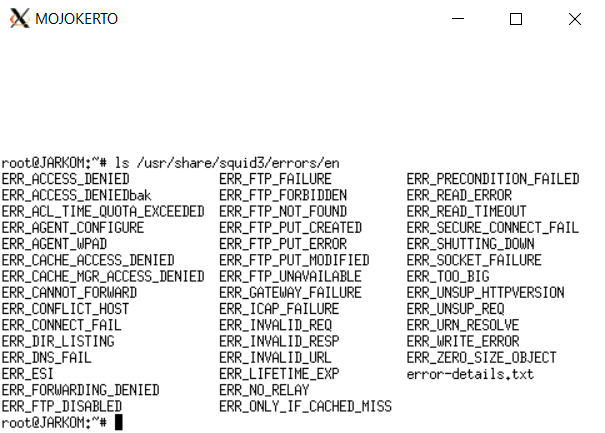
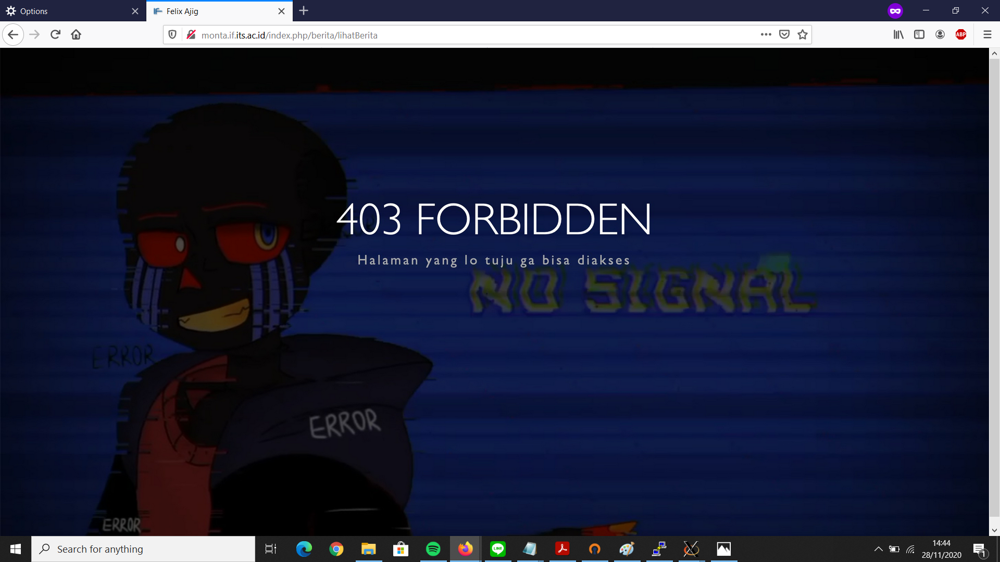
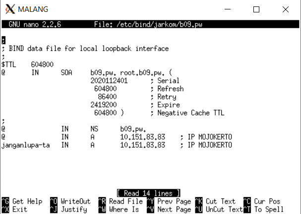

# Jarkom_Modul3_Lapres_B09
## Soal 1
Membuat topologi jaringan  
  
Penjelasan :
- Script 'topologi.sh' mengikuti gambar soal.
## Soal 2
Surabaya menjadi perantara (DHCP Relay) antara DHCP Server dan client  
  
Penjelasan :
- Lakukan install iscp-dhcp-relay di SURABAYA.
- Masukan IP TUBAN saat instalasi.
## Soal 3 - 6
  
  
Penjelasan :
- Tambahkan interface eth0 pada file `isc-dhcp-server`
- Tambahkan 3 subnet pada `dhcpd.conf` mengikuti gambar soal.
#### Soal 3
Client pada subnet 1 mendapatkan range IP dari 192.168.0.10 sampai 192.168.0.100 dan 192.168.0.110 sampai 192.168.0.200  
Penjelasan :
- Pada subnet 192.168.0.0 tambahkan range sesuai permintaan.
#### Soal 4
Client pada subnet 3 mendapatkan range IP dari 192.168.1.50 sampai 192.168.1.70.  
Penjelasan :
- Pada subnet 192.168.1.0 tambahkan range sesuai permintaan.
#### Soal 5
Client mendapatkan DNS Malang dan DNS 202.46.129.2 dari DHCP  
Penjelasan :
- Masukan option domain name server DNS diminta di soal dan DNS MALANG.
#### Soal 6
Client di subnet 1 mendapatkan peminjaman alamat IP selama 5 menit, sedangkan client pada subnet 3 mendapatkan peminjaman IP selama 10 menit  
Penjelasan :
- Ganti default-lease-time dan max-lease-time jadi 300 dan 600.
## Soal 7 - 10
  
  
#### Soal 7
User autentikasi milik Anri  
Penjelasan :
- Buat file autentikasi dengan command htpasswd
- Tambahkan auth_param dan deny apabila bukan user pada file `squid.conf`
#### Soal 8
Membatasi penggunaan hanya pada setiap hari Selasa-Rabu pukul 13.00-18.00  
Penjelasan :
- Buat variable acl dengan format `TW 13:00-18:00` pada file `acl.conf`
#### Soal 9
Membatasi penggunaan hanya pada setiap hari Selasa-Kamis pukul 21.00 - 09.00 keesokan harinya (sampai Jumat jam 09.00)  
Penjelasan :
- Buat variable acl dengan format `TWH 21:00-23:59` pada file `acl.conf`
- Buat variable acl dengan format `WHF 00:00-09:00` pada file `acl.conf`
#### Soal 10
Ketika mengakses google.com, makan akan di redirect menuju monta.if.its.ac.id  
Penjelasan :
- Buat variable acl untuk redirect domain google.com
- Redirect menggunakan perintah deny_info
## Soal 11
Mengubah error page default squid  
  
  
Penjelasan :
- Download file error pengganti.
- Copy file ke directory sesuai di gambar.
## Soal 12
Proxy cukup dengan mengetikkan domain janganlupa-ta.b09.pw dan memasukkan port 8080  
  
Penjelasan :
- Buat domain janganlupa-ta.b09.pw di DNS MALANG diarahkan ke IP MOJOKERTO
